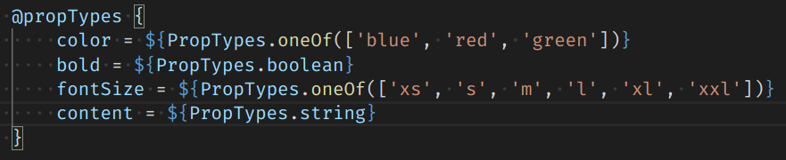
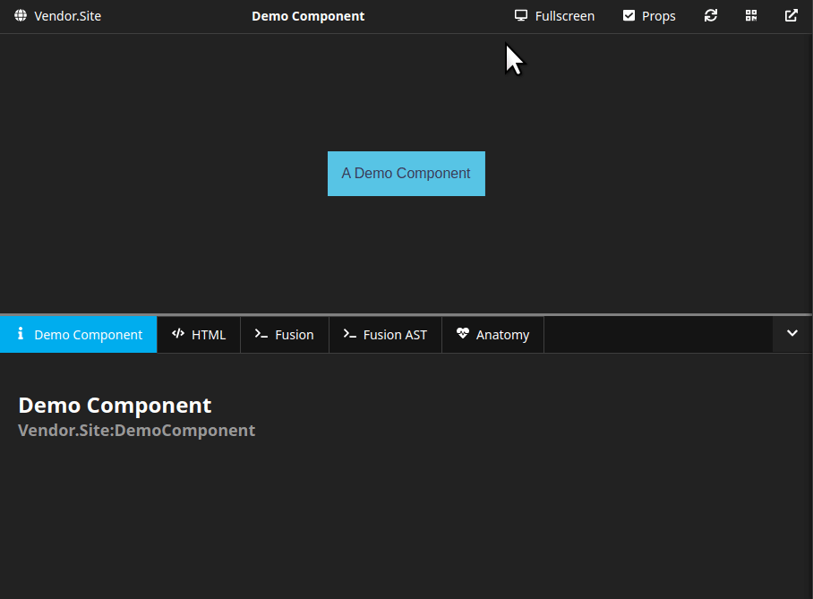

# Sitegeist.Monocle.PropTypes

> An addon for Sitegeist.Monocle that generates a rich prop editor configuration from PackageFactory.AtomicFusion.PropTypes

<p align="center">



:arrow_down:
:arrow_down:
:arrow_down:



</p>

Sitegeist.Monocle.PropTypes is a zero-configuration addon for [Sitegeist.Monocle](https://github.com/sitegeist/Sitegeist.Monocle) that scans your [`@propTypes`](https://github.com/PackageFactory/atomic-fusion-proptypes) annotation and provides the Monocle UI with a corresponding prop editor configuration.

### Authors & Sponsors

* Wilhelm Behncke - behncke@sitegeist.de

*The development and the public-releases of this package was generously sponsored
by our customer https://www.cornelsen.de and our employer https://www.sitegeist.de.*

## Installation

```
composer require sitegeist/monocle-proptypes
```

## Prop Editors

| PropType | Editor |
|-|-|
| `PropTypes.boolean` | CheckBox |
| `PropTypes.string` | Text |
| `PropTypes.integer` | Text, but cast to `integer` |
| `PropTypes.float` | Text, but cast to `float` |
| `PropTypes.oneOf` | SelecBox (with options that match the arguments of `oneOf`) |
| `PropTypes.anyOf` | Provides the editor for the first PropType within its arguments  |

## Configuration

You don't need to configure anything for Sitegeist.Monocle.PropTypes to work. In rare cases however, it might be that the PropTypes validator factory from PackageFactory.AtomicFusion.PropTypes (that is usually found under the context name `PropTypes`) is linked under a different context name.

In that case, you can provide the differing context name in the configuration for this package like this:

```yaml
Sitegeist:
  Monocle:
    PropTypes:
      fusionContextName: 'MyCustomPropTypesContext'
```

## Contribution

We will gladly accept contributions. Please send us pull requests.

## License

See [LICENSE](./LICENSE)
